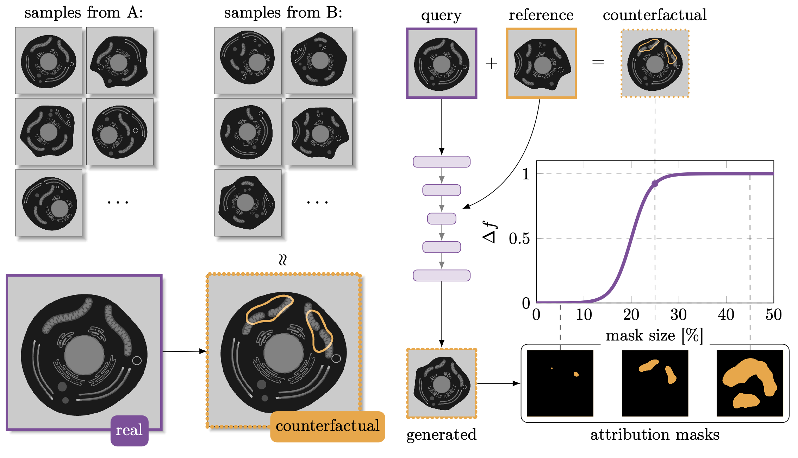

# Quantitative Attributions with Counterfactuals 

Pre-print can be found on [bioRxiv](https://www.biorxiv.org/content/10.1101/2021.01.08.425840v1)
Documentation can be found [here](https://funkelab.github.io/quac/).

Installing:
1. Clone this repository
2. Create a `conda` environment with `python, pytorch, torchvision`; I recommend `mamba`
3. Activate your new environment (`mamba activate ...`)
4. Change into the directory holding this repository.
5. `pip install .`

Installing as developer:
1. - 4. Same as above.
5. `pip install -e .\[dev\]`

Logo made with the help of DALL-E 2.
