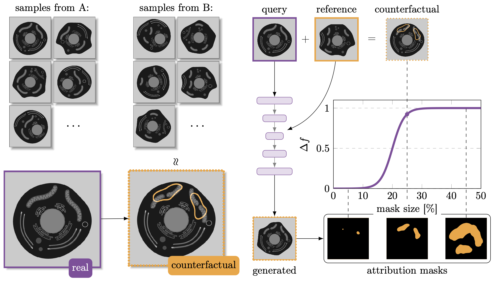

# Quantitative Attributions with Counterfactuals 

[](https://github.com/funkelab/quac/actions/workflows/ci.yml)
[](https://github.com/funkelab/quac/actions/workflows/deploy-docs.yaml)
[](https://doi.org/10.1101/2024.11.26.625505)

Pre-print can be found on [bioRxiv](https://www.biorxiv.org/content/10.1101/2024.11.26.625505v1)
Documentation can be found [here](https://funkelab.github.io/quac/).



## Installing

```bash
pip install git+https://github.com/funkelab/quac
```

## Development

Clone this repository, then install [`uv`](https://docs.astral.sh/uv/) and run:

```bash
uv sync
```

This creates a `.venv` with the package and all `dev` dependencies.
Run tests with `uv run pytest`, and linting with `uv run prek run -a`.
To install the git hooks, run `uv run prek install`.

On linux, the default `torch` wheels from PyPI include CUDA.
To use smaller CPU-only wheels instead, run `uv sync --group cpu`.

Alternatively, you can use [`pixi`](https://pixi.sh/latest/installation/)
(e.g. `pixi shell -e dev`).


Logo made with the help of DALL-E 2.
The code for training the StarGAN is adapted from the [Official Pytorch Implementation of StarGANv2](https://github.com/clovaai/stargan-v2).
